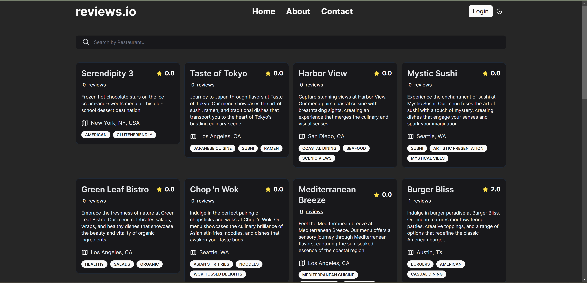
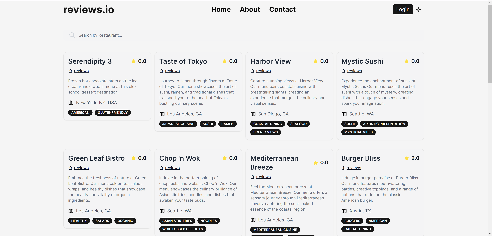
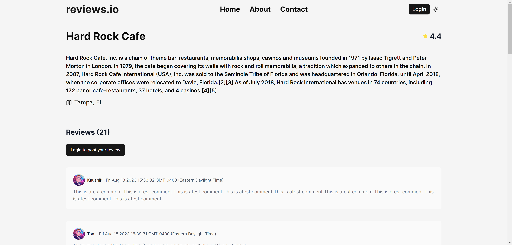
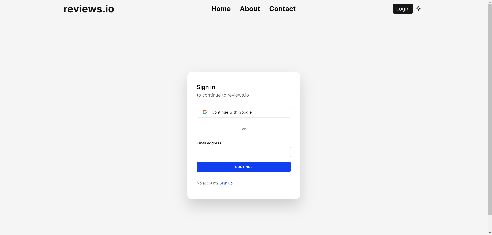
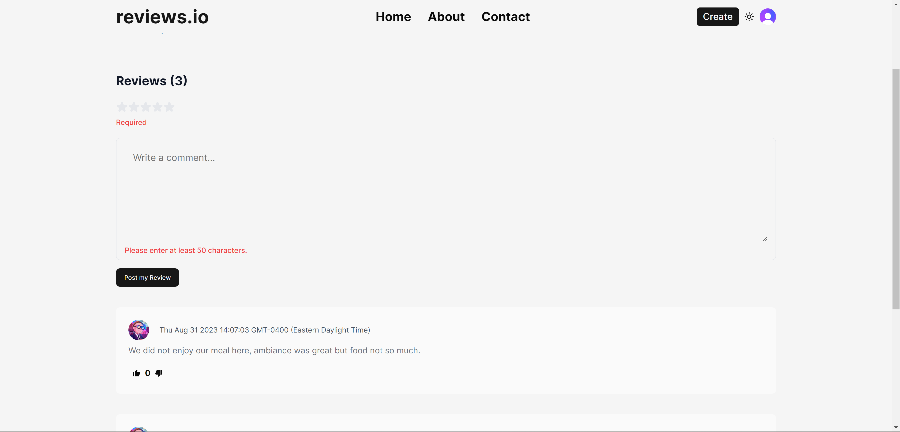
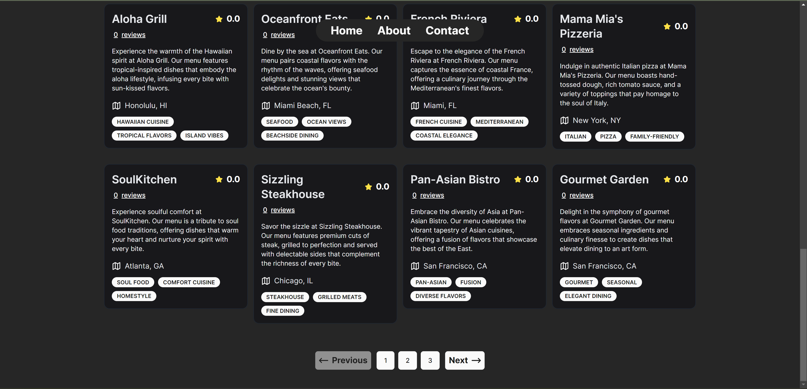
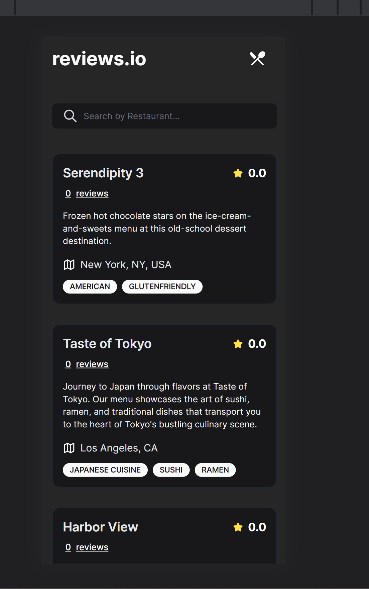

<br/>
<p align="center">
<a href="https://github.com/Kaushik612/reviews.io">
    
  </a>
  <h3 align="center">Reviews.io</h3>

  <p align="center">
    A Modern website which accumulates crowd-sourced reviews about restaurants
    <br/>
  </p>
</p>

  

## Table Of Contents

- [Screenshots](#screenshots)
- [About the Project](#about-the-project)
- [Built With](#built-with)
- [Getting Started](#getting-started)
  - [Prerequisites](#prerequisites)
  - [Installation](#installation)
- [License](#license)
- [Authors](#authors)

## Screenshots















## About The Project

A Modern website for reviewing your favorite Restaurants and checking out reviews from other customers.

The idea behind building this website is to get a good understanding of developing a fully functional Full stack application using Next.js framework and MongoDB as a backend database.

This application is built using all the new Next.js 13 features and also features TypeScript which makes everything just better!

I use Clerk for authentication which I feel makes setting up auth for your Next.js projects a breeze.

### Built With

- [![Next][Next.js]][Next-url]
- [![React][React.js]][React-url]
- [![Tailwind][Tailwind.css]][Tailwind-url]
- [![Typescript][Typescript]][Typescript-url]
- [![Prisma][Prisma]][Prisma-url]
- [![MongoDB][MongoDB]][MongoDB-url]

### Features:

- Tailwind design and Framer-motion animations
- Fully Responsive
- Clerk Authentication (Email, Google, 9+ Social Logins)
- Client form validation and handling using react-hook-form & zod
- Server error handling using react-toast
- Page loading state
- How to write POST, DELETE, and GET routes in route handlers (app/api)
- How to fetch data in server react components by directly accessing database (WITHOUT API! like Magic!)
- How to handle relations between Server and Child components!
- How to reuse layouts
- Folder structure in Next 13 App Router
- Sample About and Contact page that can be expanded as required

<p align="right">(<a href="#readme-top">back to top</a>)</p>

## Getting Started

### Prerequisites

**Node version 18.x.x**

### Cloning the repository

```shell
git clone https://github.com/Kaushik612/reviews.io.git
```

### Install packages

```sh
npm install
```

### Setup .env file

```js
NEXT_PUBLIC_CLERK_PUBLISHABLE_KEY=
CLERK_SECRET_KEY=

NEXT_PUBLIC_CLERK_SIGN_IN_URL=/sign-in
NEXT_PUBLIC_CLERK_SIGN_UP_URL=/sign-up
NEXT_PUBLIC_CLERK_AFTER_SIGN_IN_URL=/dashboard
NEXT_PUBLIC_CLERK_AFTER_SIGN_UP_URL=/dashboard

DATABASE_URL=

NEXT_PUBLIC_APP_URL="http://localhost:3000"
```

### Setup Google Places

Please read the documentation here on how to generate the API key to use Google Maps Javascript API.

```shell
https://tintef.github.io/react-google-places-autocomplete/docs/
```

### Setup Prisma

Add MongoDb Database (I am using Mongo Atlas)

```shell
npx prisma init
npx prisma generate
npx prisma db push
```

Seed Data:

I am using ChatGPT to generate seed data that will be fed to the database and I would suggest you do the same too. This saves a lot of time in creating test data and you can use this time to work on the UI development.

```shell
node lib/seed.ts
```

### Start the app

```shell
npm run dev
```

<p align="right">(<a href="#readme-top">back to top</a>)</p>

## License

Distributed under the MIT License. See [LICENSE](https://github.com/Kaushik612/reviews.io/blob/main/LICENSE.md) for more information.

## Authors

**Kaushik Ravikumar** - _Full Stack Web Developer_ - [Kaushik Ravikumar](https://github.com/kaushik612)

<!-- MARKDOWN LINKS & IMAGES -->
<!-- https://www.markdownguide.org/basic-syntax/#reference-style-links -->

[contributors-shield]: https://img.shields.io/github/contributors/github_username/repo_name.svg?style=for-the-badge
[contributors-url]: https://github.com/github_username/repo_name/graphs/contributors
[forks-shield]: https://img.shields.io/github/forks/github_username/repo_name.svg?style=for-the-badge
[forks-url]: https://github.com/github_username/repo_name/network/members
[stars-shield]: https://img.shields.io/github/stars/github_username/repo_name.svg?style=for-the-badge
[stars-url]: https://github.com/github_username/repo_name/stargazers
[issues-shield]: https://img.shields.io/github/issues/github_username/repo_name.svg?style=for-the-badge
[issues-url]: https://github.com/github_username/repo_name/issues
[license-shield]: https://img.shields.io/github/license/github_username/repo_name.svg?style=for-the-badge
[license-url]: https://github.com/github_username/repo_name/blob/master/LICENSE.txt
[linkedin-shield]: https://img.shields.io/badge/-LinkedIn-black.svg?style=for-the-badge&logo=linkedin&colorB=555
[linkedin-url]: https://linkedin.com/in/linkedin_username
[product-screenshot]: images/screenshot.png
[Next.js]: https://img.shields.io/badge/next.js-000000?style=for-the-badge&logo=nextdotjs&logoColor=white
[Next-url]: https://nextjs.org/
[React.js]: https://img.shields.io/badge/React-20232A?style=for-the-badge&logo=react&logoColor=61DAFB
[React-url]: https://reactjs.org/
[Tailwind.css]: https://img.shields.io/badge/Tailwind_CSS-38B2AC?style=for-the-badge&logo=tailwind-css&logoColor=white
[Tailwind-url]: https://tailwindcss.com/
[Typescript]: https://img.shields.io/badge/TypeScript-007ACC?style=for-the-badge&logo=typescript&logoColor=white
[Typescript-url]: https:/typescript.org
[Prisma]: https://img.shields.io/badge/Prisma-3982CE?style=for-the-badge&logo=Prisma&logoColor=white
[Prisma-url]: https:/prisma.io
[MongoDB]: https://img.shields.io/badge/MongoDB-4EA94B?style=for-the-badge&logo=mongodb&logoColor=white
[MongoDB-url]: https:/mongodb.com
